# Government Data Schema Documentation

## Overview
The govdata module provides access to U.S. government data from two primary sources:
- **SEC (Securities and Exchange Commission)**: Financial filings and corporate data
- **GEO (Geographic)**: Census TIGER boundaries, demographics, and HUD crosswalks

## Entity Relationship Diagram

```mermaid
erDiagram
    %% SEC Schema Tables
    FILING_METADATA {
        string cik PK "Central Index Key (10-digit)"
        string filing_type PK "10-K, 10-Q, 8-K, etc."
        integer year PK "Fiscal year"
        string accession_number PK "Unique SEC document ID"
        string company_name "Legal entity name"
        date filing_date "Date submitted to SEC"
        date period_end_date "End of reporting period"
        string state_of_incorporation FK "2-letter state code"
        string sic_code "Standard Industrial Classification"
        string irs_number "IRS employer ID"
        string fiscal_year_end "Company's FY end date"
    }
    
    FINANCIAL_LINE_ITEMS {
        string cik PK,FK "Central Index Key"
        string filing_type PK,FK "Filing type"
        integer year PK,FK "Fiscal year"
        string accession_number PK,FK "SEC document ID"
        string concept PK "XBRL concept name"
        string period PK "instant/duration"
        decimal numeric_value "Financial amount"
        string units "USD, shares, etc."
        integer decimals "Decimal precision"
        date period_start "Period start date"
        date period_end "Period end date"
        string segment "Business segment"
        string state_of_incorporation FK "2-letter state code"
    }
    
    FILING_CONTEXTS {
        string cik PK,FK "Central Index Key"
        string filing_type PK,FK "Filing type"
        integer year PK,FK "Fiscal year"
        string accession_number PK,FK "SEC document ID"
        string context_id PK "Context identifier"
        date period_start "Context period start"
        date period_end "Context period end"
        string entity "Entity identifier"
        string segment "Segment info"
        string scenario "Scenario info"
    }
    
    FOOTNOTES {
        string cik PK,FK "Central Index Key"
        string filing_type PK,FK "Filing type"
        integer year PK,FK "Fiscal year"
        string accession_number PK,FK "SEC document ID"
        string footnote_id PK "Footnote identifier"
        string footnote_role "Role/category"
        string footnote_text "Full text content"
        string concept_ref "Related concept"
        string language "Language code"
    }
    
    INSIDER_TRANSACTIONS {
        string cik PK,FK "Company CIK"
        string filing_type PK,FK "Form 3/4/5"
        integer year PK,FK "Transaction year"
        string accession_number PK,FK "SEC document ID"
        string transaction_id PK "Transaction ID"
        string insider_cik "Insider's CIK"
        string insider_name "Officer/Director name"
        date transaction_date "Trade date"
        string transaction_code "P=Purchase, S=Sale"
        decimal shares "Number of shares"
        decimal price_per_share "Price per share"
        string ownership_type "D=Direct, I=Indirect"
        string insider_title "Job title"
    }
    
    STOCK_PRICES {
        string ticker PK "Stock ticker symbol"
        date date PK "Trading date"
        string cik UK "Company CIK"
        decimal open "Opening price"
        decimal high "Day high"
        decimal low "Day low"
        decimal close "Closing price"
        decimal adj_close "Adjusted close"
        bigint volume "Trading volume"
        string exchange "Stock exchange"
    }
    
    %% GEO Schema Tables
    TIGER_STATES {
        string state_fips PK "2-digit FIPS code"
        string state_code UK "2-letter USPS code"
        string state_name "Full state name"
        string state_abbr "2-letter abbreviation"
        decimal land_area "Land area (sq meters)"
        decimal water_area "Water area (sq meters)"
        decimal lat_center "Latitude of center"
        decimal lon_center "Longitude of center"
        integer population "Total population"
    }
    
    TIGER_COUNTIES {
        string county_fips PK "5-digit FIPS code"
        string state_fips FK "2-digit state FIPS"
        string county_name "County name"
        string county_type "County/Parish/Borough"
        decimal land_area "Land area (sq meters)"
        decimal water_area "Water area (sq meters)"
        decimal lat_center "Latitude of center"
        decimal lon_center "Longitude of center"
        integer population "Total population"
    }
    
    CENSUS_PLACES {
        string place_code PK "5-digit place code"
        string state_code PK,FK "2-letter state code"
        string place_name "City/town name"
        string place_type "City/Town/CDP"
        integer population "Total population"
        integer housing_units "Housing unit count"
        decimal median_income "Median household income"
        decimal lat_center "Latitude"
        decimal lon_center "Longitude"
    }
    
    HUD_ZIP_COUNTY {
        string zip PK "5-digit ZIP code"
        string county_code FK "5-digit county FIPS"
        decimal res_ratio "Residential address ratio"
        decimal bus_ratio "Business address ratio"
        decimal oth_ratio "Other address ratio"
        decimal tot_ratio "Total ratio"
        string usps_city "USPS city name"
        string state_code "2-letter state code"
    }
    
    HUD_ZIP_TRACT {
        string zip PK "5-digit ZIP code"
        string tract PK "11-digit census tract"
        string county_code FK "5-digit county FIPS"
        decimal res_ratio "Residential ratio"
        decimal bus_ratio "Business ratio"
        decimal oth_ratio "Other ratio"
        decimal tot_ratio "Total ratio"
    }
    
    TIGER_ZCTAS {
        string zcta5 PK "5-digit ZCTA code"
        string namelsad "Name and description"
        string mtfcc "MAF/TIGER feature class"
        string funcstat "Functional status"
        decimal land_area "Land area (sq meters)"
        decimal water_area "Water area (sq meters)"
        decimal intpt_lat "Internal point latitude"
        decimal intpt_lon "Internal point longitude"
        integer population "Total population"
        integer housing_units "Total housing units"
        decimal aland_sqmi "Land area (sq miles)"
        decimal awater_sqmi "Water area (sq miles)"
        decimal pop_density "Population per sq mile"
    }
    
    TIGER_CENSUS_TRACTS {
        string tract_geoid PK "11-digit tract GEOID"
        string state_fips FK "2-digit state FIPS"
        string county_fips FK "3-digit county FIPS"
        string tract_code "6-digit tract code"
        string namelsad "Name and description"
        string mtfcc "MAF/TIGER feature class"
        string funcstat "Functional status"
        decimal land_area "Land area (sq meters)"
        decimal water_area "Water area (sq meters)"
        decimal intpt_lat "Internal point latitude"
        decimal intpt_lon "Internal point longitude"
        integer population "Total population"
        integer housing_units "Total housing units"
        decimal aland_sqmi "Land area (sq miles)"
        decimal awater_sqmi "Water area (sq miles)"
        decimal pop_density "Population per sq mile"
        decimal median_income "Median household income"
    }
    
    TIGER_BLOCK_GROUPS {
        string bg_geoid PK "12-digit block group GEOID"
        string state_fips FK "2-digit state FIPS"
        string county_fips FK "3-digit county FIPS"
        string tract_code FK "6-digit tract code"
        string blkgrp "1-digit block group number"
        string namelsad "Name and description"
        string mtfcc "MAF/TIGER feature class"
        string funcstat "Functional status"
        decimal land_area "Land area (sq meters)"
        decimal water_area "Water area (sq meters)"
        decimal intpt_lat "Internal point latitude"
        decimal intpt_lon "Internal point longitude"
        integer population "Total population"
        integer housing_units "Total housing units"
        decimal aland_sqmi "Land area (sq miles)"
        decimal awater_sqmi "Water area (sq miles)"
    }
    
    TIGER_CBSA {
        string cbsa_code PK "5-digit CBSA code"
        string cbsa_name "CBSA name"
        string namelsad "Name and description"
        string lsad "Legal/statistical area code"
        string memi "Metropolitan/Micropolitan"
        string mtfcc "MAF/TIGER feature class"
        decimal land_area "Land area (sq meters)"
        decimal water_area "Water area (sq meters)"
        decimal intpt_lat "Internal point latitude"
        decimal intpt_lon "Internal point longitude"
        string cbsa_type "Metropolitan/Micropolitan"
        integer population "Total population"
        decimal aland_sqmi "Land area (sq miles)"
        decimal awater_sqmi "Water area (sq miles)"
    }
    
    HUD_ZIP_CBSA_DIV {
        string zip PK "5-digit ZIP code"
        string cbsadiv PK "CBSA Division code"
        string cbsadiv_name "Division name"
        string cbsa FK "Parent CBSA code"
        string cbsa_name "Parent CBSA name"
        decimal res_ratio "Residential ratio"
        decimal bus_ratio "Business ratio"
        decimal oth_ratio "Other ratio"
        decimal tot_ratio "Total ratio"
        string usps_city "USPS city name"
        string state_code "2-letter state code"
    }
    
    HUD_ZIP_CONGRESSIONAL {
        string zip PK "5-digit ZIP code"
        string cd PK "Congressional District code"
        string cd_name "District name"
        string state_cd "State-District code"
        decimal res_ratio "Residential ratio"
        decimal bus_ratio "Business ratio"
        decimal oth_ratio "Other ratio"
        decimal tot_ratio "Total ratio"
        string usps_city "USPS city name"
        string state_code FK "2-letter state code"
        string state_name "State name"
    }
    
    CENSUS_DEMOGRAPHICS {
        string geo_id PK "Geographic identifier"
        string geo_type "State/County/Place/Tract"
        integer total_population "Total population"
        integer households "Number of households"
        decimal median_age "Median age"
        decimal median_income "Median household income"
        integer housing_units "Total housing units"
        decimal poverty_rate "Poverty rate percentage"
        string state_code FK "2-letter state code"
        string county_code FK "5-digit county FIPS"
    }
    
    %% Relationships within SEC
    FILING_METADATA ||--o{ FINANCIAL_LINE_ITEMS : "contains"
    FILING_METADATA ||--o{ FILING_CONTEXTS : "defines"
    FILING_METADATA ||--o{ FOOTNOTES : "has"
    FILING_METADATA ||--o{ INSIDER_TRANSACTIONS : "reports"
    FILING_CONTEXTS ||--o{ FINANCIAL_LINE_ITEMS : "contextualizes"
    
    %% Relationships within GEO
    TIGER_STATES ||--o{ TIGER_COUNTIES : "contains"
    TIGER_STATES ||--o{ CENSUS_PLACES : "contains"
    TIGER_COUNTIES ||--o{ HUD_ZIP_COUNTY : "contains"
    TIGER_COUNTIES ||--o{ HUD_ZIP_TRACT : "contains"
    TIGER_COUNTIES ||--o{ TIGER_CENSUS_TRACTS : "contains"
    TIGER_CENSUS_TRACTS ||--o{ TIGER_BLOCK_GROUPS : "contains"
    TIGER_CBSA ||--o{ HUD_ZIP_CBSA_DIV : "subdivides"
    TIGER_STATES ||--o{ HUD_ZIP_CONGRESSIONAL : "contains"
    TIGER_STATES ||--o{ CENSUS_DEMOGRAPHICS : "aggregates"
    TIGER_COUNTIES ||--o{ CENSUS_DEMOGRAPHICS : "aggregates"
    
    %% Cross-domain relationships (SEC to GEO)
    FINANCIAL_LINE_ITEMS }o--|| TIGER_STATES : "incorporated_in"
    FILING_METADATA }o--|| TIGER_STATES : "incorporated_in"
    STOCK_PRICES }o--|| FINANCIAL_LINE_ITEMS : "relates_to"
```



## Table Descriptions

### SEC Schema Tables

#### FILING_METADATA
Core information about SEC filings including company details, filing dates, and document identifiers. This is the parent table for all filing-related data.

#### FINANCIAL_LINE_ITEMS
Financial statement line items extracted from XBRL filings. Each row represents a single financial concept (e.g., Revenue, NetIncome) with its value for a specific reporting period.

#### FILING_CONTEXTS
XBRL contexts that define the circumstances under which facts are reported (time periods, entities, segments).

#### FOOTNOTES
Textual footnotes and disclosures from financial statements, linked to specific line items and contexts.

#### INSIDER_TRANSACTIONS
Stock transactions by company insiders (officers and directors) from Forms 3, 4, and 5.

#### STOCK_PRICES
Daily stock price data including OHLC (Open, High, Low, Close) and volume, linked to companies via CIK.

### GEO Schema Tables

#### TIGER_STATES
U.S. state boundaries and metadata from Census TIGER/Line shapefiles, including geographic and demographic attributes.

#### TIGER_COUNTIES
County boundaries and attributes. Counties are the primary legal divisions of states.

#### CENSUS_PLACES
Census designated places including cities, towns, and villages with population and housing data.

#### HUD_ZIP_COUNTY
HUD USPS ZIP code to county crosswalk, mapping ZIP codes to counties with residential and business ratios.

#### HUD_ZIP_TRACT
ZIP code to census tract crosswalk for more granular geographic analysis.

#### TIGER_ZCTAS
ZIP Code Tabulation Areas from Census TIGER data. ZCTAs are approximate postal areas built from census blocks, providing more consistent geographic boundaries than actual ZIP codes.

#### TIGER_CENSUS_TRACTS
Small, relatively permanent statistical subdivisions of counties. Census tracts have between 1,200 and 8,000 residents and are designed to be relatively homogeneous with respect to population characteristics.

#### TIGER_BLOCK_GROUPS
Statistical divisions of census tracts containing 600-3,000 people. Block groups are the smallest geographic unit for which the Census Bureau publishes sample data (American Community Survey).

#### TIGER_CBSA
Core Based Statistical Areas including Metropolitan Statistical Areas (50,000+ population) and Micropolitan Statistical Areas (10,000-49,999 population) with their urban cores and economically integrated counties.

#### HUD_ZIP_CBSA_DIV
HUD crosswalk mapping ZIP codes to CBSA Divisions (Metropolitan Divisions within large Metropolitan Statistical Areas), enabling sub-metropolitan analysis for large urban areas.

#### HUD_ZIP_CONGRESSIONAL
HUD crosswalk mapping ZIP codes to Congressional Districts with residential and business address ratios. Essential for political analysis and connecting demographic data to legislative representation.

#### CENSUS_DEMOGRAPHICS
Demographic and economic statistics aggregated at various geographic levels.

## Cross-Domain Relationships

The key cross-domain relationship connects SEC financial data to geographic data through state of incorporation:

- `FINANCIAL_LINE_ITEMS.state_of_incorporation` → `TIGER_STATES.state_code`
- `FILING_METADATA.state_of_incorporation` → `TIGER_STATES.state_code`

This enables queries that combine financial performance with geographic analysis, such as:
- Revenue by state of incorporation
- Insider trading patterns by geographic region
- Economic indicators correlated with corporate performance

## Query Examples

### Find companies incorporated in California with their latest revenue
```sql
SELECT 
  f.company_name,
  fl.numeric_value as revenue,
  s.state_name
FROM sec.filing_metadata f
JOIN sec.financial_line_items fl 
  ON f.cik = fl.cik 
  AND f.filing_type = fl.filing_type
  AND f.year = fl.year
JOIN geo.tiger_states s 
  ON f.state_of_incorporation = s.state_code
WHERE s.state_code = 'CA'
  AND fl.concept = 'Revenue'
  AND f.filing_type = '10-K'
  AND f.year = 2023;
```

### Analyze insider trading by geographic region
```sql
SELECT 
  s.state_name,
  COUNT(*) as transaction_count,
  SUM(it.shares * it.price_per_share) as total_value
FROM sec.insider_transactions it
JOIN sec.filing_metadata fm 
  ON it.cik = fm.cik
JOIN geo.tiger_states s 
  ON fm.state_of_incorporation = s.state_code
WHERE it.transaction_code = 'P'  -- Purchases only
  AND it.year = 2023
GROUP BY s.state_name
ORDER BY total_value DESC;
```

### Population-weighted financial metrics
```sql
SELECT 
  c.county_name,
  c.population,
  AVG(fl.numeric_value) as avg_revenue_per_company
FROM geo.tiger_counties c
JOIN geo.tiger_states s 
  ON c.state_fips = s.state_fips
JOIN sec.filing_metadata fm 
  ON s.state_code = fm.state_of_incorporation
JOIN sec.financial_line_items fl 
  ON fm.cik = fl.cik
WHERE fl.concept = 'Revenue'
  AND fl.year = 2023
GROUP BY c.county_name, c.population
HAVING COUNT(DISTINCT fm.cik) > 5;
```

## Data Sources

- **SEC Data**: Downloaded from EDGAR (https://www.sec.gov/edgar)
- **TIGER Data**: U.S. Census Bureau TIGER/Line Shapefiles
- **HUD Data**: HUD USPS ZIP Code Crosswalk Files
- **Census Data**: American Community Survey (ACS) via Census API
- **Stock Prices**: Yahoo Finance or similar financial data providers

## Partitioning Strategy

### SEC Tables
Partitioned by: `cik` / `filing_type` / `year`
- Enables efficient queries by company, filing type, or time period
- Supports incremental updates as new filings arrive

### GEO Tables  
Partitioned by: `source` / `type` / `geographic_level`
- `source`: tiger, census, hud
- `type`: boundary, demographic, crosswalk
- Enables efficient geographic queries at different granularities