# Government Data Schema Relationships

## Entity Relationship Diagram

```mermaid
erDiagram
    %% SEC Domain Tables
    financial_line_items {
        string cik PK
        string filing_type PK
        int year PK
        date filing_date PK
        string concept PK
        string context_ref PK,FK
        decimal value
        string unit
        string segment
    }
    
    filing_contexts {
        string cik PK
        string filing_type PK
        int year PK
        date filing_date PK
        string context_id PK
        date start_date
        date end_date
        boolean instant
        string segment
    }
    
    filing_metadata {
        string cik PK
        string filing_type PK
        int year PK
        date filing_date PK
        string company_name
        string sic_code
        string state_of_incorporation FK
        string fiscal_year_end
        string business_address
        string business_phone
    }
    
    mda_sections {
        string cik PK
        string filing_type PK
        int year PK
        date filing_date PK
        string section_id PK
        string section_text
        int section_order
    }
    
    xbrl_relationships {
        string cik PK
        string filing_type PK
        int year PK
        date filing_date PK
        string relationship_id PK
        string from_concept
        string to_concept
        string arc_role
    }
    
    insider_transactions {
        string cik PK
        string filing_type PK
        int year PK
        date filing_date PK
        string transaction_id PK
        string insider_cik
        string insider_name
        date transaction_date
        string transaction_type
        decimal shares
        decimal price_per_share
    }
    
    earnings_transcripts {
        string cik PK
        string filing_type PK
        int year PK
        date filing_date PK
        string transcript_id PK
        string speaker
        string text
        int sequence
    }
    
    stock_prices {
        string ticker PK
        date trade_date PK
        string cik FK
        decimal open
        decimal high
        decimal low
        decimal close
        bigint volume
        decimal adjusted_close
    }
    
    vectorized_blobs {
        string cik PK
        string filing_type PK
        int year PK
        date filing_date PK
        string blob_id PK
        string blob_type
        string content
        array embedding
        int start_offset
        int end_offset
    }
    
    %% GEO Domain Tables
    tiger_states {
        string state_fips PK
        string state_code
        string state_name
        geometry boundary
        decimal land_area
        decimal water_area
    }
    
    tiger_counties {
        string county_fips PK
        string state_fips FK
        string county_name
        geometry boundary
        decimal land_area
        decimal water_area
    }
    
    census_places {
        string place_code PK
        string state_code PK,FK
        string place_name
        int population
        decimal median_income
        geometry boundary
    }
    
    hud_zip_county {
        string zip PK
        string county_fips FK
        decimal res_ratio
        decimal bus_ratio
        decimal oth_ratio
        decimal tot_ratio
    }
    
    hud_zip_tract {
        string zip PK
        string tract PK
        string county_fips FK
        decimal res_ratio
        decimal bus_ratio
        decimal oth_ratio
        decimal tot_ratio
    }
    
    hud_zip_cbsa {
        string zip PK
        string cbsa_code PK
        string cbsa_title
        decimal res_ratio
        decimal bus_ratio
        decimal oth_ratio
        decimal tot_ratio
    }
    
    %% Relationships within SEC domain
    financial_line_items ||--o{ filing_contexts : "has context"
    
    %% Relationships within GEO domain
    tiger_counties }o--|| tiger_states : "belongs to"
    census_places }o--|| tiger_states : "located in"
    hud_zip_county }o--|| tiger_counties : "maps to"
    hud_zip_tract }o--|| tiger_counties : "within"
    
    %% Cross-domain relationships (SEC to GEO)
    filing_metadata }o--|| tiger_states : "incorporated in"
    stock_prices }o--|| filing_metadata : "belongs to company"
```



## Cross-Domain Foreign Key Relationships

### Direct Cross-Domain FKs

1. **filing_metadata.state_of_incorporation → tiger_states.state_code**
   - Companies are incorporated in specific states
   - Enables queries like "all companies incorporated in Delaware"

### Potential Cross-Domain Relationships (via parsing/geocoding)

2. **filing_metadata.business_address → hud_zip_county.zip**
   - Business addresses contain ZIP codes
   - Would require parsing address field to extract ZIP
   - Enables geographic analysis of company headquarters

3. **insider_transactions → census_places**
   - If insider addresses were captured, could link to cities
   - Enables analysis of insider trading patterns by geography

4. **stock_prices.ticker → geographic market data**
   - Stock exchanges have geographic locations
   - Could analyze trading patterns by exchange location

## Table Categories

### SEC Tables (Partitioned by cik/filing_type/year)
- **financial_line_items**: XBRL financial statement data
- **filing_contexts**: XBRL context definitions
- **filing_metadata**: Company and filing information
- **mda_sections**: Management Discussion & Analysis text
- **xbrl_relationships**: Concept relationships and calculations
- **insider_transactions**: Forms 3, 4, 5 insider trading data
- **earnings_transcripts**: 8-K earnings call transcripts
- **stock_prices**: Daily stock price data (partitioned by ticker/year)
- **vectorized_blobs**: Text embeddings for semantic search

### GEO Tables (Static or slowly changing)
- **tiger_states**: State boundaries and metadata
- **tiger_counties**: County boundaries and metadata
- **census_places**: City/town data with demographics
- **hud_zip_county**: ZIP to county mapping
- **hud_zip_tract**: ZIP to census tract mapping
- **hud_zip_cbsa**: ZIP to metro area mapping

## Query Examples Using Cross-Domain Relationships

```sql
-- Companies incorporated in California with their stock performance
SELECT 
    m.company_name,
    m.state_of_incorporation,
    s.state_name,
    AVG(p.close) as avg_stock_price
FROM filing_metadata m
JOIN tiger_states s ON m.state_of_incorporation = s.state_code
JOIN stock_prices p ON m.cik = p.cik
WHERE s.state_name = 'California'
GROUP BY m.company_name, m.state_of_incorporation, s.state_name;

-- Financial performance by state of incorporation
SELECT 
    s.state_name,
    COUNT(DISTINCT f.cik) as company_count,
    AVG(f.value) as avg_net_income
FROM financial_line_items f
JOIN filing_metadata m ON f.cik = m.cik 
    AND f.filing_type = m.filing_type 
    AND f.year = m.year
JOIN tiger_states s ON m.state_of_incorporation = s.state_code
WHERE f.concept = 'NetIncomeLoss'
GROUP BY s.state_name
ORDER BY avg_net_income DESC;

-- Geographic concentration of tech companies (using SIC codes)
SELECT 
    s.state_name,
    COUNT(DISTINCT m.cik) as tech_company_count
FROM filing_metadata m
JOIN tiger_states s ON m.state_of_incorporation = s.state_code
WHERE m.sic_code BETWEEN '7370' AND '7379' -- Computer services
GROUP BY s.state_name
ORDER BY tech_company_count DESC;
```

## Implementation Notes

### Primary Keys
- All SEC tables use composite PKs including partition columns (cik, filing_type, year)
- GEO tables use natural keys (FIPS codes, ZIP codes, etc.)

### Foreign Keys
- Within-domain FKs are strongly typed and enforced via metadata
- Cross-domain FKs require data transformation or parsing
- State codes need standardization (2-letter vs FIPS)

### Data Freshness
- SEC data is continuously updated via RSS feeds
- GEO data is updated annually (Census/TIGER releases)
- Stock prices updated daily

### Performance Considerations
- Partition pruning critical for SEC queries
- Geographic joins benefit from spatial indexes
- Cross-domain joins should filter early to reduce data movement